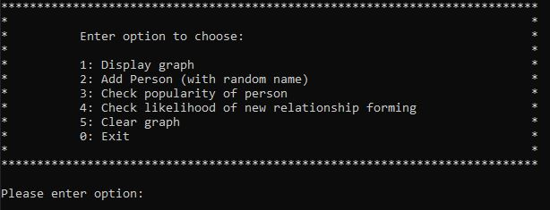

# Social_Network
This project represents an app using a toy example of a social network which illustrates the power of Neo4j’s graph algorithms

## Input:

Starting the app presents the user a menu with options to choose from as seen in the following screenshot.

## Methodology:

Person node containing property 'name' generated at random will be added as node to the graph database and relationships to existing Person nodes created at random with equal likelihood.

## Output:

- Display the graph in browser
- PageRank score for requested person node to reflect that person's popularity
- Shorthest path between two people to show how they are related within the social network
- Likelyhood of relationship between two people being established based on link prediction algorithm

