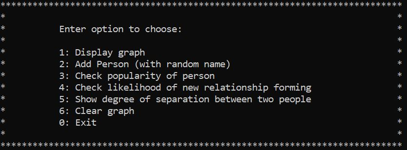
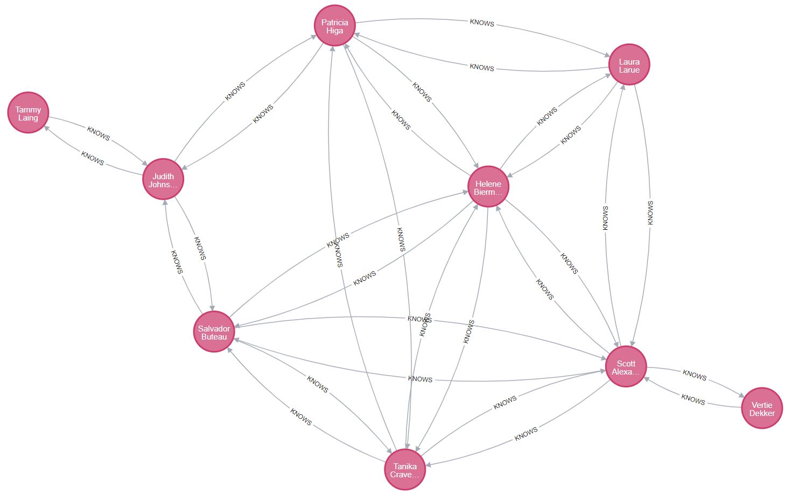
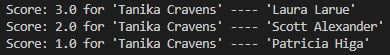

# Social_Network
This project represents an app that uses a toy example of a social network stored as a graph database which illustrates the power of Neo4j’s graph algorithms and graph data science tools

## Input:

When starting the app the user is presented with a menu with several options to choose from as seen in the following screenshot.

## Methodology:

A person node containing the property 'name' will be generated at random and will be added to the graph database and relationships to existing person nodes are created at random with equal likelihood.

## Output:

- Display the graph in browser
- PageRank score for requested person node to reflect that person's popularity
- Shorthest path between two people to show how they are related within the social network
- Likelyhood of relationship between two people being established based on link prediction algorithm

